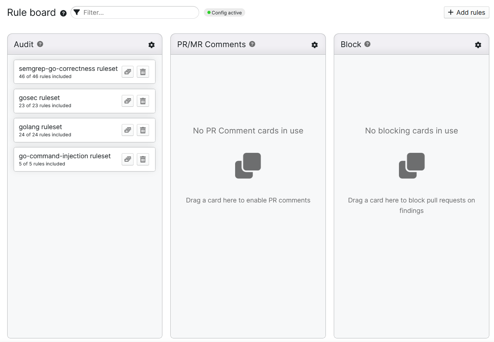

import MoreHelp from "/src/components/MoreHelp"

# Rule board

The Rule Board is a visual representation of the rules that Semgrep App uses to scan code. Rules can be organized into rulesets. Rulesets are rules related through programming language, OWASP category, framework, and so on.

Rules and rulesets are displayed as **cards**. Group cards by dragging and dropping cards into the columns. Columns represent the actions undertaken in response to findings from that rule or ruleset.

The columns and their corresonding actions are:

<dl>
    <dt>Audit</dt>
    <dd>Rules here show findings only on Semgrep App.</dd>
    <dt>PR/MR Comments</dt>
    <dd>Rules here show findings to developers through PR or MRs.</dd>
    <dt>Block</dt>
    <dd>Rules here show block merges and commits, in addition to showing findings in Semgrep App and PRs or MRs.</dd>
</dl>

Semgrep App is  pre-configured to use the `default` ruleset. The `default` ruleset scans for security vulnerabilities in common programming languages and frameworks.

Semgrep App detects the framework and language when scanning a project and only runs rules relevant for that framework and language.

## Adding rules or rulesets

### Through the search bar

1. Click **Add rules**. A sidebar appears.
2. Search for rules by entering a relevant search term, such as your programming language, OWASP category, or framework in the search bar.
3. Optional: Display the rules within a ruleset by clicking on the **Expand** icon beside the name of the ruleset.
4. Optional: Display the rule definition by clicking on the **View in Playground** icon beside the name of the rule.
5. Drag the card and drop it on the relevant column.
6. Once you are done adding rules and rulesets, click **Save changes**.

### From Semgrep Registry

1. Search
As you explore the [Semgrep Registry](https://semgrep.dev/r),
you will see buttons named "Add these to Policy".
Click this button and select the "Rule board" option.
The new cards will appear on your board when you next open the page.

When writing rules in [Semgrep Playground](https://semgrep.dev/editor),
you will see a button named "Add to Policy".
Click this button and select the "Rule board" option.
The new card will appear on your board when you next open the page.

### From Semgrep Playground

### From the in-app Editor

## Removing rules or rulesets

To remove a ruleset:

1. Click the **garbage can** icon.
2. Click **Remove**.
3. Click **Save changes**.

Rules within a ruleset can't be deleted. They can be disabled. To disable a rule:

1. Drag...
2. Click Save.

## Removing rules or rulesets

### Rules

To disable just one rule from a ruleset,
expand the ruleset with the "rules" button.
Then drag specific rules to the side column on the right.
This will disable those rules but keep the rest of the ruleset enabled.

## Configuring notifications

Notifications enable you to keep track of Semgrep scans within your preferred environment, such as email or Slack.

Prerequisites

* An existing notification channel

To configure notifications click the bell button in the top right corner of a column.

You can enable [third-party notifications](../notifications/)
and [inline pull request comments](../notifications/#pull-request-comments)
on a per-column basis in the resulting panel.
## Columns

### Side column

The side column on the right of the board displays various kinds of cards that are inactive.

#### Registry search

Search the Semgrep Registry for rulesets via the search box at the top of the side column.
Search results will appear in this column.

#### Recommended cards

Semgrep will recommend relevant rulesets based on technologies it finds in your repositories and show them here.

#### Disabled rules

Find and restore rules previously removed from active rulesets here.

<MoreHelp />
