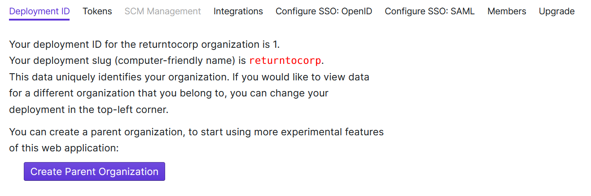

import MoreHelp from "/src/components/MoreHelp"

# Integrating Semgrep into source code management (SCM) tools

Semgrep App's Team tier supports repositories hosted on both **GitHub Enterprise (GHE)** and **GitLab Self Managed (GLSM)** plans. Create multiple integrations in different self-hosted or custom servers.

## Prerequisites

You need the following permissions to integrate Semgrep into GHE or GLSM servers:

* Permission to create a personal access token (PAT) for the repository to scan Semgrep on. This PAT is used to enable Semgrep App to create pull request (PR) or merge request (MR) comments for findings that can be [autofixed](../notifications/#automatically-fix-your-findings-through-pull-or-merge-requests).
* Permission to add CI/CD secrets into your [GitHub](https://docs.github.com/en/actions/security-guides/encrypted-secrets) or [GitLab](https://docs.gitlab.com/ee/ci/secrets/) environments.

## Integrating Semgrep into GitHub Enterprise or GitLab Self Managed 

Integrate Semgrep into these custom source code management (SCM) tools by following the steps below:

1. Sign in to [Semgrep App](https://semgrep.dev/login).
2. Click **[Settings](https://semgrep.dev/orgs/-/settings)** > **Create new parent organization**.

3. Enter the name of your parent organization.
4. Sign out, then sign in again to enable SCM management.
5. Click **Settings** > **SCM management** > **Configure new SCM**.

6. Select your SCM provider.
7. For **GitHub Enterprise**, follow the steps below:
    1. Create a personal access token (PAT) by following the steps outlined in this [guide to creating a PAT](https://docs.github.com/en/enterprise-server@3.1/authentication/keeping-your-account-and-data-secure/creating-a-personal-access-token).
    2. Enter the personal access token generated into the Access Token field.
    3. Enter your GHE base URL into the SCM Base URL.
8. For **GitLab Self Managed**, follow the steps below:
    1. Create a personal access token (PAT) by following the steps outlined in this [guide to creating a PAT](https://docs.gitlab.com/ee/user/profile/personal_access_tokens.html).
    2. Enter the personal access token generated into the Access Token field.
    3. Enter your GLSM base URL into the **SCM Base URL** field.
9. Ensure that your SCM integration successfully detects repositories by following the steps below:
    1. Click **Projects > Setup New Project**.
    2. Select your CI provider.
    3. Semgrep App detects repositories from your SCM integration.
10. Add a new repository by following the steps in [Adding a project](../getting-started-with-semgrep-app/#adding-a-project).

## Additional references
* [Semgrep's May 2022 updates: DeepSemgrep, New Playground, and Self Managed GitHub and GitLab support](https://r2c.dev/blog/2022/semgreps-may-2022-updates/)

<MoreHelp />
